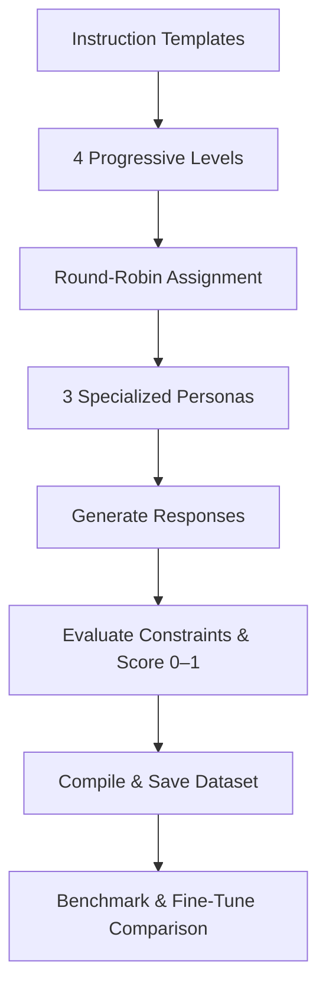

# PrecisionTuner: Measurable Instruction-Following Dataset Generator

## What I Built

A Python-based dataset generator that crafts instruction–response pairs to progressively build and measure an LLM’s ability to follow precise constraints. Each of the 100 samples is generated by one of three specialized AI personas, evaluated on format, length, forbidden-word avoidance, and required-element inclusion,then assigned an objective quality score for benchmarking and fine-tuning.

---

## Submission Title

**PrecisionTuner: Progressive Constraint Learning for LLM Instruction-Following**

---

## The Problem

Existing instruction-following datasets lack granularity in measuring adherence to specific requirements. You can’t easily tell whether a model:

* Produced valid JSON, Markdown, lists, XML, or YAML
* Hit exact word counts within tolerance
* Avoided forbidden terms
* Included all required elements
* Truly improved after fine-tuning

Without these metrics, training smaller, lightweight models (SLMs) to match frontier LLM performance remains guesswork.

---

## My Solution

I designed a curriculum-driven synthetic data generator inspired by the book **LLM Engineer’s Handbook** authored by **Paul Iusztin** / **Maxime Labonne** and Professor David J. Malan’s “5 Levels of Difficulty” teaching approach 

**Progressive Learning Approach**

1. **Level 1** – Master a single constraint (e.g., exact word count)
2. **Level 2** – Coordinate two constraints (length + forbidden-word avoidance)
3. **Level 3** – Integrate three constraints (format + length + content requirements)
4. **Level 4** – Expert-level mastery (all constraint types combined)

Each level reinforces the previous, building toward multi-constraint coordination and deeper instruction-following skill.

---

## How It Works

### Multiple AI Models for Variety

Three Ollama-hosted models, each with a distinct persona:

* **Creative Storyteller** (`gemma3:1b`)
* **Knowledge Synthesizer** (`llama3.2:1b`)
* **Precision Specialist** (`phi3:3.8b`)

Round-robin assignment (`sample_index % 3`) ensures uniform coverage and mitigates single-model bias, while persona diversity boosts information gain and accelerates learning curves.

### Measurable Constraints

* **Format** (JSON, Markdown, lists, XML, YAML)
* **Length** (exact word counts with tolerance)
* **Forbidden words** detection
* **Required elements** coverage

Every response is parsed and scored (0.0–1.0) by the `ConstraintEvaluator` module, with detailed feedback for each constraint type.

### Progressive Difficulty

Instruction templates are auto-generated in `dataset_generator.py`, tagged with learning focus and difficulty weights. As levels rise, prompts combine more constraint types into a single exercise—mimicking layered human learning and reinforcement.

---

## Results

* **100 samples** evenly split across L1–L4 (25 / 25 / 25 / 25)
* **Average quality score:** 0.7155
* **High-quality samples** (score ≥ 0.9): 40
* **Persona contributions balanced:** `gemma3:1b` (34), `llama3.2:1b` (33), `phi3:3.8b` (33)

**Output Formats**

* Hugging Face `DatasetDict` splits (train/validation/test)
* Raw JSON dump
* Pure Alpaca format (`instruction`/`input`/`output`)
* Enhanced Alpaca format with rich metadata (quality\_score, model\_used, constraint\_level, evaluation\_feedback, etc.)

---

## Framework Overview

---

## Why This Matters

By quantifying instruction-following, you can objectively track model progress, compare architectures, and target fine-tuning efforts—transforming a previously subjective task into a reproducible engineering metric.

---

## Future Work & Research Potential

* **Scaling to SLMs:** Fine-tune smaller models on L1→L4 and benchmark against frontier LLMs.
* **Adaptive Curriculum Learning:** Dynamically assign samples based on performance to accelerate convergence.
* **Multi-Modal Extensions:** Add constraints for code compilation checks, image/layout validation, or API response correctness.
* **Automated Difficulty Calibration:** Tune difficulty weights via performance analytics.
* **Community Benchmark & Leaderboard:** Publish a public leaderboard of L1→L4 mastery curves.
* **Integration with RLHF:** Use quantitative constraint scores as rewards in reinforcement-learning-from-human-feedback setups.

---

## Code Structure

* **main.py** – Orchestrates dataset generation and saving
* **dataset\_generator.py** – Builds templates and drives the Ollama client in round-robin
* **precision\_tuner.py** – Manages multi-model loading, persona prompts, and cleanup
* **constraint\_evaluator.py** – Implements format/length/forbidden/required-element scoring
* **dataset\_saver.py** – Saves outputs in multiple formats and writes statistics

---

## Credits

Built with concepts from the **LLM Engineer’s Handbook** (Packt) and Professor **David J. Malan’s** talk in youtube on "Algorithms in 5 Levels of Difficulty"
