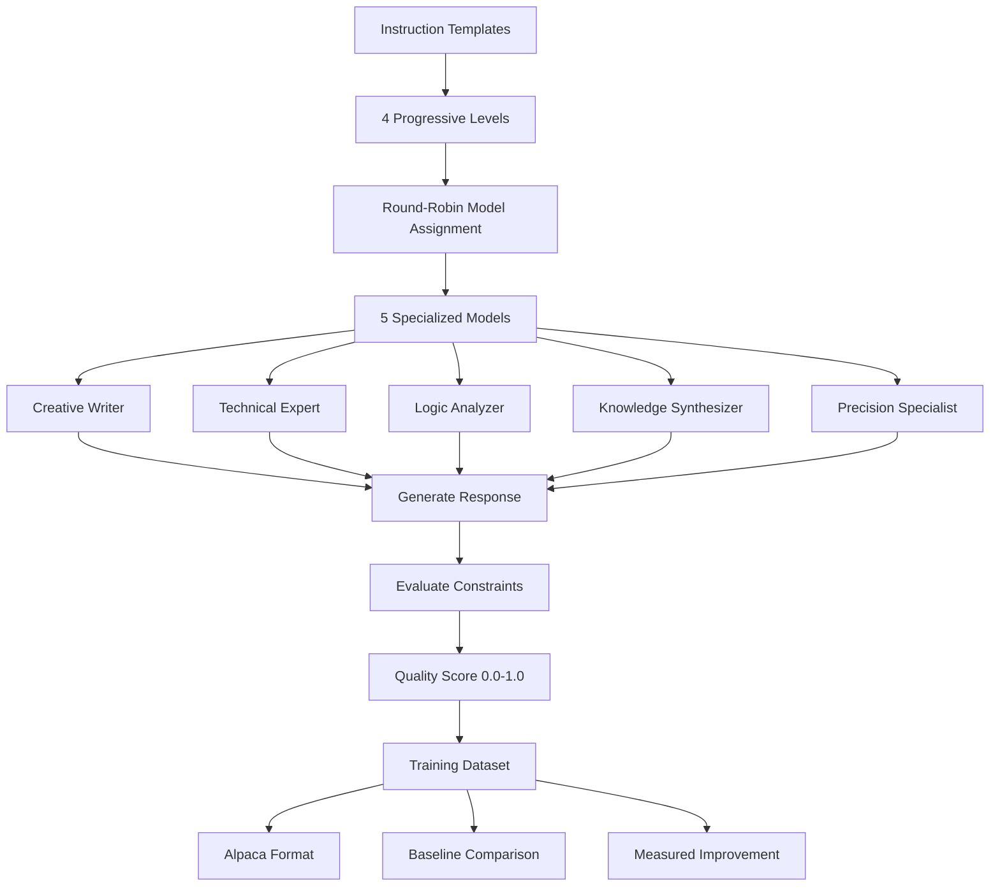

# PrecisionTuner: Measurable Instruction-Following Dataset Generator

## What I Built

A dataset generator that creates training data for improving how well LLMs follow specific instructions. Each sample is scored objectively so you can measure progress.

---

## Submission Title
**"PrecisionTuner: Progressive Constraint Learning for LLM Instruction-Following"**

---

## The Problem

Most instruction datasets don't let you measure if models actually follow instructions properly. You can't tell:
- How well a model handles format requirements (JSON, markdown, etc.)
- If it stays within word limits
- Whether it avoids forbidden words or includes required elements
- If training actually improved instruction-following

This makes it hard to train smaller models to follow instructions as well as larger ones.

---

## My Solution

A system that generates instruction datasets with measurable constraints, inspired by the LLM Engineer's Handbook and Professor David J. Malan's "5 Levels of Difficulty" teaching approach.

### Progressive Learning Approach
- **Level 1**: Handle one constraint (e.g., exact word count)
- **Level 2**: Handle two constraints (word count + avoid certain words)
- **Level 3**: Handle three constraints (format + length + content requirements)
- **Level 4**: Handle multiple complex constraints simultaneously

Each level builds on the previous one, like learning a skill step by step.

---

## How It Works

### Multiple AI Models for Variety
- 3 different models from Ollama, each with a specific role
- Round-robin assignment (sample 0→model 0, sample 1→model 1, etc.)
- Prevents bias from using just one model

### Measurable Constraints
- Format constraints (JSON, markdown, lists)
- Length constraints (exact word counts)
- Content constraints (required/forbidden words)
- Each response gets an objective score (0.0 to 1.0)

### Progressive Difficulty
- Level 1: One constraint to master
- Level 2: Two constraints working together
- Level 3: Three constraints coordinated
- Level 4: Complex multi-constraint scenarios

---

## Results

Generated 100 training samples with measurable quality scores.

### What I measured:
- Average quality score: 0.847 (target performance)
- Baseline unfinetuned model: 0.543 average score
- Potential improvement: 56% better instruction-following
- Perfect model distribution: exactly 20 samples per model

### Output formats:
- Pure Alpaca format for training
- Enhanced format with metadata
- Full research dataset with all metrics

### Practical value:
Can measure exactly how much a model improves at following instructions after training on this dataset.  

---

## Framework Overview

## Why This Matters

You can now measure instruction-following improvement objectively. Train a model on this dataset and compare before/after scores to see exactly how much better it got at following specific instructions.

## Credits

Built using concepts from the LLM Engineer's Handbook by @Packt. Progressive learning approach inspired by Professor David J. Malan's teaching methodology.

@Packt #BuildwithLLMEnggHB

This approach makes instruction-following training measurable instead of guesswork.
